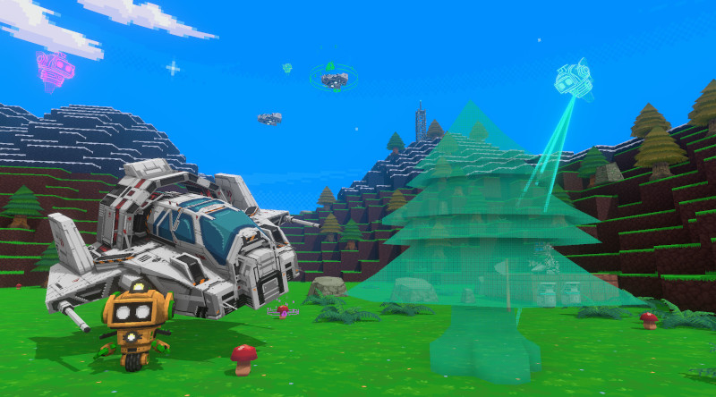

This project is no longer actively developed or maintained.

# Game Builder

Welcome to the Game Builder open-source repository. This is the source
code to build Game Builder, an application that allows users to
create games with little or no coding experience. We are excited to share
the source code with the community and are looking forward to seeing
what you will create!

This is not an officially supported Google product.

## Pre-requisites

* Unity 2018.4.9f1

    It will probably work with later 2018.4.* versions, but this is the one we
    tested with. Unity 2019 is known to *not* work. If in doubt, use this exact
    version.

* [Python 2](http://python.org) to run code_gen scripts.

* If you are using a Windows machine, you also need Git Bash
  (part of [Git for Windows](https://gitforwindows.org/))
  to run shell scripts. If you are using a Mac, you don't need it:
  the built-in Terminal app is enough.

## Running in Unity Editor

1. Open the project (just the root of the repo).
1. Open the splash screen scene: Assets/Scenes/splash.unity
1. When the "TMP Importer" shows, click "Import TMP Essentials".
1. Restart Unity.
1. Click on the Play button.

## Building the standalone EXE

To build a standalone, you *must* use the menu item `Game Builder
| Build`. Going through the normal Unity Build Settings window will *not* work.
Once done, your build will be located under the `steamworks_####` folder.

We have included a reference build under `builds` (it's the file whose
name begins with `gamebuilder-OSS`). This is the build that you should get
if you simply compile the source as-is, without enabling any extra plugins.

## Scripting documentation

For documentation about how the in-game scripting works, open the `docs.html`
file in a browser (after downloading/cloning this repository).

# Optional features

Game Builder was originally built using several Unity Asset Store plugins. We
cannot include them in the repo, so by default the features that require them
are disabled. However, we've set things up so it's easy to re-enable some
features once you've purchased and imported some plugins (many are free!).
Instructions for individual features are below.

## Common instructions

- Running shell scripts: Whenever these instructions mention that you must run a
  given shell script, it's implied that you must run it (e.g 'bash shellscript.sh') in Git Bash (or OSX
  terminal) at the root of the repository.

- Define a C# directive: When these instructions tell you to "define a C#
  directive" this means adding a C# #define symbol. To do this:
  * In Unity, open `File | Build Settings`
  * Go to `Player Settings | Other Settings | Configuration`
  * Add the directive to the end of the `Scripting Define Symbols` text field (with a semi-colon before it)
  * Restart Unity

## Features that can be enabled for *free*

* [Photon Unity Networking](https://assetstore.unity.com/packages/tools/network/photon-unity-networking-classic-free-1786) - Enables multiplayer and collaborative-editing
    - NOTE: Because PUN integration is complex, we recommend you start with a
      *fresh* checkout of the codebase before following these steps. This
      reduces the likelihood of prefabs losing important property values after
      being edited without PUN.
    - First run the project as-is, freshly checked out, just to make sure it's working.
    - Don't forget to confirm TMPro's import dialog (import TMP Essentials).
    - Import the plugin from the Asset Store link above.
    - Define the directive `USE_PUN`
    - *Close* Unity before the next step
    - Run the shell script `setup-photon.sh`
    - Sign up for a PUN account (https://www.photonengine.com/)
    - In the PUN website, create a new application (type: *Photon PUN*)
    - Copy your new application's *AppId*.
    - Open the Unity project again and wait for importing to finish
    - Enter your AppId if prompted, but if not, go to the next step (the dialog
      might freeze while Unity imports assets, but don't worry, just wait until
      it finishes).
    - Finally, inspect the "PhotonServerSettings" asset and change the following:
        - "Hosting" to "Best Region"
        - "Regions" to "Everything"
        - Paste your AppId into the "AppId" field

    - Making sure it's all working:
      - After the above steps, make a build (`Game Builder | Build`).
      - Run the build and create a private multiplayer game (`New Project | Empty | Private MP`).
      - Run another instance (using the same build copy is fine) and join that game (`Multiplayer | Use Join Code`).
      - Confirm that both "players" can run around as their robots (red and green), and that movements are seen by both.
      - Confirm that when one player scales an actor (like the text box), the other player sees the size change as well.
      - If these don't work, try this: In Unity's project window, inspect the
        Actor prefab. In its PhotonView component, does it have
        "ActorNetworking" as one of its "Observed components"? If it does not,
        then something went wrong, and you should start over with a fresh
        checkout.

* [Crosstales File Browser](https://assetstore.unity.com/packages/tools/utilities/file-browser-standalone-98716) - Enables local disk import/export features

    - Import the plugin from the Asset Store link above.
    - Define the directive `USE_FILEBROWSER`.

* Poly Toolkit for Unity

    To enable importing 3D models from [Poly](https://poly.google.com),
    you must enter an API Key for the Poly API.

    You do *NOT* need to import the Poly SDK (Poly Toolkit). It's already
    included. All you need to do is enter your API key.

    To do so, click the PtSettings.asset file in Unity (you will find it in
    Assets/third_party/PolyToolkit/Resources). The Inspector window will
    show several options for it. Click the RUNTIME tab, open the Auth Config
    section and enter your API Key, replacing the placeholder text
    "INSERT YOUR API KEY HERE".

    For instructions on how to get an API key, see the
    [Google Cloud Console](https://console.cloud.google.com/).
    When you create your Google Cloud
    Console project, don't forget to enable the Poly API on it *before*
    (not after) generating your API Key.

* Google Image Search

    To enable Google Image Search in you Creation Library, you must setup a Custom Search Engine on Google Cloud Platform.

    (Instructions assume basic familiarity with Google Cloud)
    - Create a new project on Google Cloud Platform
    - Enable the “Custom Search API”
    - Create an API Key for the Custom Search API (via “Create Credentials”) 
    - Inside the Unity project, paste the generated API key in to the `APIkey` variable at the top of GisSearchManager.cs
    - Go to the Custom Search Engine control panel (cse.google.com) and create a new search engine. When creating the search engine, enter any domain (we will delete it in the next step).
    - Edit the new search engine
      - Remove the site to search
      - Turn on “search the entire web”
      - Turn on “image search” and “safe search”
      - Inside the Unity project, copy the search engine's ID and paste it in to the searchID variable at the top of GisSearchManager.cs
    - You are all set!

## Features that require premium plugins

* [2D Shaper Library](https://assetstore.unity.com/packages/tools/gui/2d-shaper-library-105973)

    If you want game-generated 2D graphics (that is, you want to allow games
    to show HUD text, draw shapes on the screen, etc).
    - Import the plugin from the Asset Store link above.
    - Define the directive USE_SHAPER_2D_LIBRARY. 
    
* [Steam Workshop](https://assetstore.unity.com/packages/tools/integration/steam-workshop-easy-steamworks-integration-86189) - If you are releasing on Steam and want to enable functionality like project sharing.
    - Import the plugin from the Asset Store link above.
    - Run the shell script "setup-steamworks.sh".
    - Define the directive USE_STEAMWORKS.
    - Find the file "steam_appid.txt" in the repo root (NOT the one in "redist"). Put your AppID in there (instead of 480).
    
* [TriLib](https://assetstore.unity.com/packages/tools/modeling/trilib-model-loader-package-91777) - To import FBX files with animation from Poly.
    - Import the plugin from the Asset Store link above.
    - Define the directive USE_TRILIB.

* [Embedded Browser](https://assetstore.unity.com/packages/tools/gui/embedded-browser-55459)

    This plugin allows rendering of an HTML page inside of Game Builder,
    which enables you to use the Monaco-based code editor IDE.
    - Import the plugin from the Asset Store link above.
    - Define the directive `USE_ZFBROWSER`
    - Run the shell script `setup-browser-assets.sh`

## Archival Build

In the `builds` directory, you will also find the last build that we published
to Steam (`gamebuilder-ARCHIVE-*.7z`). This differs from the open-source build
because it has several optional plugins enabled such as 2D UI, rich JS editor,
etc.

## License

See the LICENSE file for more details.

## Contributing

This repository does not currently accept pull requests, but
you are welcome to fork it to make your own version of it, if you
want to.
